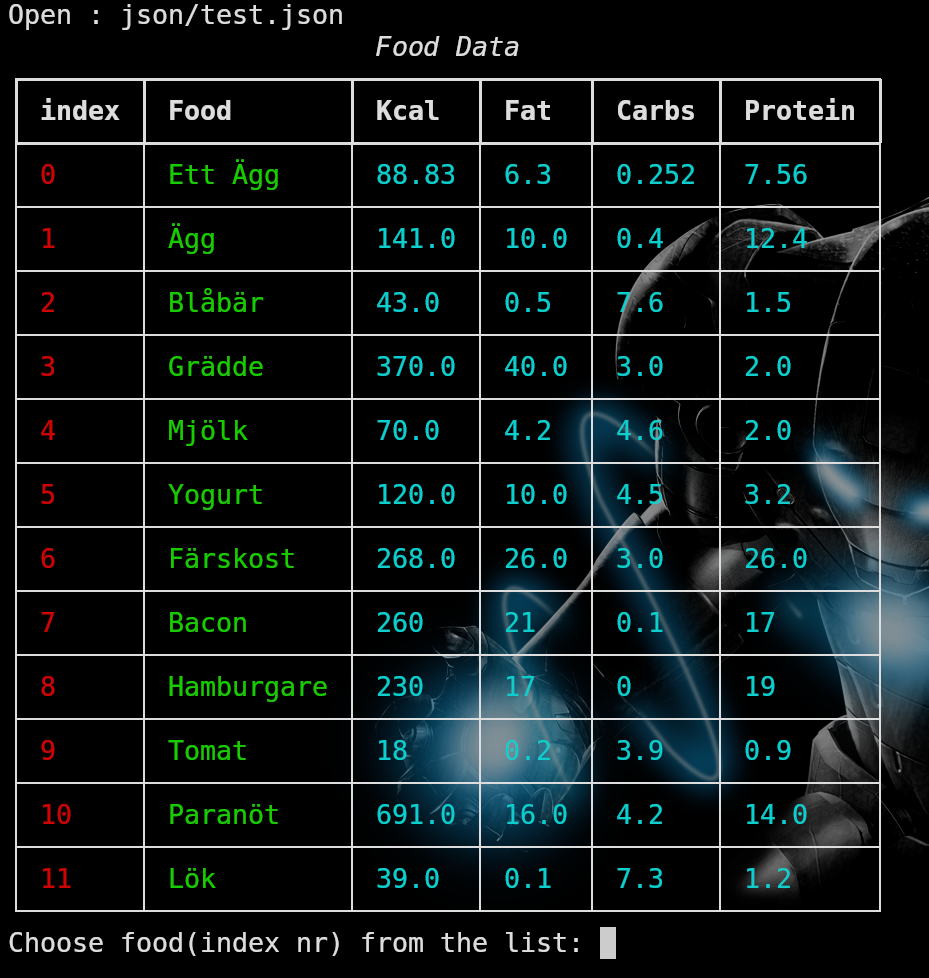

# food_calc
Food calculator 

## Python terminal food calc app.


### Installation:
```bash
    git clone https://github.com/eklownr/food_calc.git
    cd food_calc
    pip install rich
    python3 main.py
```

### Usage:
```bash
    rm json/all_food.json # Remove the old food database
    python3 add_food.py # Set up your food database
    python3 main.py # Run the food app
```